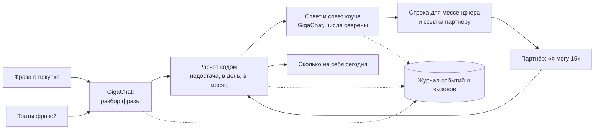

# Finance Assistant — крупная покупка к дате

> Финансовый коуч на GigaChat для пар, у которых у каждого свои деньги. Пишешь обычной фразой — «котёл 40 тысяч к 15 ноября, я могу 25» — и сразу видишь, **сойдётся ли покупка к сроку, сколько откладывать и сколько можно потратить на себя сегодня**. Партнёр подключается по ссылке и видит только покупку, а не чужие деньги.

Проект программы **Sber500 × Disrupt**, трек «Разрабатываю продукт с нуля», гипотеза «Личный финансовый коуч».

**Статус на 21 сентября 2026:** исследование закрыто — 16 интервью с 9 парами; требования к MVP и кликабельный прототип готовы. Код пишется с 22 сентября 2026 года, в период конкурса; история коммитов этого репозитория — подтверждение.

---

## Для кого

Для пар, у которых нет общего котла: у каждого свои деньги и свои карты в разных банках, а крупное — котёл, ремонт, кровать, отпуск — обсуждают заранее: хватит ли к сроку и кто платит. Скидываются долями или платит один — продукту всё равно.

Сегмент задан не возрастом и доходом, а тем, как устроены деньги пары. Не наш клиент: пары с общим бюджетом у одного партнёра и пары, где деньги у одного и выдаются по запросу.

## Какую задачу решаем

**Основная:** когда впереди крупная общая покупка, понять, сойдётся ли сумма к сроку, сколько мне откладывать и — если платим оба — кто сколько внесёт. Сейчас это считают в голове и в разговоре, а до даты каждый сам следит, успевает ли.

**Ежедневная:** сколько сегодня можно потратить на себя, чтобы своя часть успела к сроку.

## Как это работает

1. **Одна фраза про покупку.** GigaChat разбирает название, сумму, срок и свою часть; если чего-то нет — один уточняющий вопрос.
2. **Расчёт делает код:** сколько не хватает, сколько откладывать в день и в месяц. Числа в ответе модели сверяются с расчётом.
3. **Ответ и совет коуча:** «не хватает 15 000 ₽» и 1–2 варианта — сколько внести партнёру, что будет при переносе срока.
4. **Отправить партнёру** готовую строку для мессенджера. По ссылке партнёр видит, что увидит и чего не увидит, и отвечает фразой «я могу 15».
5. **Сколько на себя сегодня:** приходы и обязательные траты одной фразой, траты — фразой.
6. **Когда сумма сошлась** — подсказка, как собрать деньги сбором или копилкой в банке. Хранить и переводить деньги продукт не берётся.



## Принципы

- **Модель — только GigaChat.** Все задачи со смыслом текста идут через GigaChat API.
- **Деньги считает код, а не модель.** Суммы, доли и остатки — детерминированный код с тестами.
- **Партнёр никогда не видит ничьих остатков и трат** — только общую покупку и её прогресс.
- **Вход без регистрации.** Первый ответ — до регистрации и до партнёра; почта нужна, только чтобы перенести данные на другое устройство.
- **Без подключения к банкам и без хранения денег.**
- **Журнал каждого действия и каждого вызова** — для метрик и антифрод-контроля.

## Стек

| Слой | Технологии |
|---|---|
| Клиент | PWA: React, TypeScript, Vite, установка на главный экран |
| Бэкенд | Python, FastAPI, PostgreSQL |
| Модель | GigaChat API: разбор фраз, ответ и совет коуча; позже — разбор скриншотов уведомлений |
| Аналитика | Журнал событий и вызовов: обезличенный идентификатор, время, тип, компонент, результат, код ошибки, источник трафика, хэши для склейки дублей; панель на чтение для организатора |
| Инфраструктура | Серверы в России |
| Разработка | Claude Code, Cursor |

Стек — предложение: любую часть можно заменить, записав причину одной строкой здесь же.

## Структура репозитория

Планируемая:

```
finance-assistant/
├── frontend/     # PWA-клиент
├── backend/      # FastAPI: API, расчёты, журнал
│   ├── calc/     # доли, сроки, «на себя сегодня» — детерминированный код с тестами
│   └── llm/      # интеграция с GigaChat
├── analytics/    # выгрузка журнала и расчёт метрик
└── docs/         # продуктовые решения, список сторонних компонентов с лицензиями
```

## План до открытия

| Даты | Что | Готово, если |
|---|---|---|
| 22–24 сентября | Каркас, стенд, журнал событий и вызовов | стенд открывается с телефона, события пишутся |
| 25–27 сентября | Фраза → GigaChat → расчёт → ответ и совет; согласие на обработку данных | сценарий до ответа проходит на своей фразе |
| 28–29 сентября | Приглашение партнёра, принятие фразой, «отложил» | на двух телефонах покупка сходится у обоих |
| 30 сентября – 1 октября | «Сколько на себя сегодня», траты фразой, удаление данных | верный остаток на тестовых датах |
| 2 октября | Правки после проверки удобства, список компонентов | незнакомый человек проходит сценарий без инструкций |
| **3 октября** | **Открытый доступ** | — |

Проверка удобства — на кликабельном прототипе 25–27 сентября и на стенде с живым GigaChat 1–2 октября.

## Метрики первого этапа

- не менее 20 клиентских интервью с целевой аудиторией;
- не менее 50 реальных пользователей вне команды и её круга — каждый получил ответ на свою покупку;
- продукт в открытом контуре с подключённой аналитикой и журналом вызовов;
- концепция вывода на рынок с планом достижения метрик и каналами;
- продуктовые: доля дошедших до первого ответа, возврат 4+ дня из 7, обращений к решению на активного пользователя в день.

## Команда

| Роль | Участник | Зона ответственности |
|---|---|---|
| Продакт | [Имя Фамилия] | Исследование, продуктовые решения, метрики, привлечение пользователей |
| Full-stack разработчик | [Имя Фамилия] | PWA, бэкенд, интеграция с GigaChat, журнал, открытый контур |
