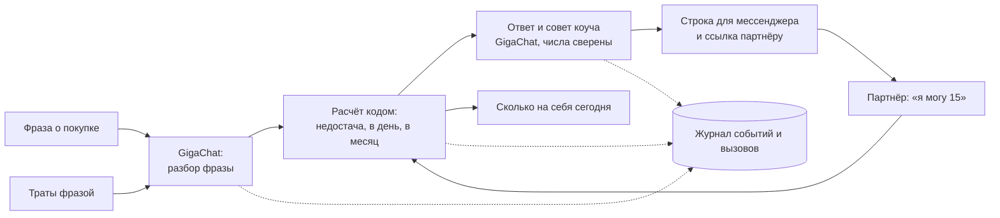

# Finance Assistant — крупная покупка к дате

> Финансовый коуч на GigaChat для пар, у которых у каждого свои деньги. Пишешь обычной фразой — «котёл 40 тысяч к 15 ноября, я могу 25» — и сразу видишь, **сойдётся ли покупка к сроку, сколько откладывать и сколько можно потратить на себя сегодня**. Партнёр подключается по ссылке и видит только покупку, а не чужие деньги.

Проект программы **Sber500 × Disrupt**, трек «Разрабатываю продукт с нуля», гипотеза «Личный финансовый коуч».

**Статус на 4 октября 2026:**

- **Исследование:** 16 интервью с 9 парами, до 20 — ещё 4.
- **Документы:** бизнес-требования 1.3 и техническое задание 1.2 от 3 октября. Новое в них: отметка «отложил» с зарплаты и остатком дня, сверка отметок с выпиской, пять поводов вернуться.
- **Разработка:** серверная часть готова у 39 из 61 требования первого релиза; каркас клиента собран, идёт проработка интерфейса.
- **Открытие:** 3 октября не состоялось, новую дату команда назовёт после оценки ТЗ 1.2.
- **Отчёты программе:** недельные отчёты за 21–27.09 и 28.09–04.10 сданы.

---

## Для кого

Для пар, у которых нет общего котла: у каждого свои деньги и свои карты в разных банках, а крупное — котёл, ремонт, кровать, отпуск — обсуждают заранее: хватит ли к сроку и кто платит. Скидываются долями или платит один — продукту всё равно.

Сегмент задан не возрастом и доходом, а тем, как устроены деньги пары. Не наш клиент: пары с общим бюджетом у одного партнёра и пары, где деньги у одного и выдаются по запросу.

## Какую задачу решаем

**Основная:** когда впереди крупная общая покупка, понять, сойдётся ли сумма к сроку, сколько мне откладывать и — если платим оба — кто сколько внесёт. Сейчас это считают в голове и в разговоре, а до даты каждый сам следит, успевает ли.

**Ежедневная:** сколько сегодня можно потратить на себя, чтобы своя часть успела к сроку.

## Как это работает

1. **Одна фраза про покупку.** GigaChat разбирает название, сумму, срок и свою часть; если чего-то нет — один уточняющий вопрос.
2. **Расчёт делает код:** сколько не хватает, сколько откладывать в день и в месяц. Числа в ответе модели сверяются с расчётом.
3. **Ответ и совет коуча:** «не хватает 15 000 ₽» и 1–2 варианта — сколько внести партнёру, что будет при переносе срока.
4. **Отправить партнёру** готовую строку для мессенджера. По ссылке партнёр видит, что увидит и чего не увидит, и отвечает фразой «я могу 15».
5. **Где взять недостающее:** выписка банка за 2–3 месяца (CSV или PDF Сбербанка) — программа находит зарплату, регулярные платежи и мелкие частые траты и сама подбирает шаги экономии, которых хватает на покупку. Файл не хранится, партнёр ничего из выписки не видит.
6. **Сколько на себя сегодня:** приходы и обязательные траты — фразой или из выписки, траты — фразой. Свои переводы, копилка и деньги от людей доход не завышают.
7. **Бот в Telegram и Max:** утром — «сегодня на себя N ₽», траты сообщением, «влезут кроссовки за 7000?», напоминание в день зарплаты. В Telegram — без сумм: деньги только в мини-приложении, данные остаются в России.
8. **«Я отложил»** — сумма с зарплаты или остаток дня («Закрыть день»). Отметки сверяются с выпиской: на фото цели подтверждённая часть видна чётко, отмеченная — в лёгкой дымке, остальное — в тумане. Партнёр видит только «по плану» и «подтверждено выпиской».
9. **Когда сумма сошлась** — подсказка, как собрать деньги сбором или копилкой в банке. Хранить и переводить деньги продукт не берётся.

```mermaid
flowchart LR
    F["Фраза о покупке"] --> G["GigaChat:<br/>разбор фразы"]
    G --> C["Расчёт кодом:<br/>недостача, в день, в месяц"]
    C --> A["Ответ и совет коуча<br/>GigaChat, числа сверены"]
    A --> S["Строка для мессенджера<br/>и ссылка партнёру"]
    S --> P["Партнёр: «я могу 15»"]
    P --> C
    T["Траты фразой"] --> G
    C --> D["Сколько на себя сегодня"]
    J[("Журнал событий и вызовов")]
    G -.-> J
    C -.-> J
    A -.-> J
```

## Принципы

- **Модель — только GigaChat.** Все задачи со смыслом текста идут через GigaChat API.
- **Деньги считает код, а не модель.** Суммы, доли и остатки — детерминированный код с тестами.
- **Партнёр никогда не видит ничьих остатков и трат** — только общую покупку и её прогресс.
- **Вход без регистрации.** Первый ответ — до регистрации и до партнёра; почта нужна, только чтобы перенести данные на другое устройство.
- **Без подключения к банкам и без хранения денег.**
- **Журнал каждого действия и каждого вызова** — для метрик и антифрод-контроля.

## Стек

| Слой | Технологии |
|---|---|
| Клиент | PWA: React, TypeScript, Vite; мини-приложение в Telegram и Max |
| Бот | Telegram — aiogram (MIT); Max — Bot API напрямую через httpx |
| Бэкенд | Python, FastAPI, PostgreSQL |
| Модель | GigaChat API: разбор фраз и сообщений боту, ответ и совет коуча, «влезет ли», категории операций, снимки выписки |
| Выписка и ссылка | CSV — свой разбор; PDF Сбербанка — Sberbank2Excel (MIT); страница товара — extruct (BSD-3) |
| Аналитика | Журнал событий и вызовов: обезличенный идентификатор, время, тип, компонент, результат, код ошибки, источник трафика, хэши для склейки дублей; панель на чтение для организатора |
| Инфраструктура | Серверы в России |
| Разработка | Claude Code, Cursor |

Стек — предложение: любую часть можно заменить, записав причину одной строкой здесь же.

## Документы для разработки

- **Бизнес-требования** — `prd/BT_finance-assistant.md`, версия 1.3: 25 требований с источником и способом проверки, 46 пограничных случаев, метрики, риски. Структура — BRS по ISO/IEC/IEEE 29148.
- **Техническое задание** — `tz/TZ_finance-assistant.md`, версия 1.2, один документ: модель расчётов, реестр экранов, 96 функциональных требований по EARS, 22 требования по 152-ФЗ, интеграции (GigaChat, Telegram, Max), релизы, 43 критерия приёмки, контрольные расчёты. Структура — ГОСТ 19.201-78 в адаптации, изменения — лист регистрации по ГОСТ 19.604-78. Для агента — `tz/AGENTS.md`, выписка-пример — `tz/statement-demo.csv`.
- **Исследование** — интервью, ценностное предложение, разборы рынка — вне репозитория, в истории git; перечень — `HISTORY.md`.
- **PDF** обоих документов собирает `python tools/build_docs.py --pdf` в папку `pdf/` (в git не хранится); сверку делает `python tools/check_docs.py`.
- **Прототип** — эталон интерфейса по ТЗ 1.2: `prototype/2026-10-03_fog-prototype.html` («Туман»), любое состояние открывается по `?s=<код>`, список кодов — в конце файла. Прежний `prototype/2026-09-24_mvp-prototype.html` остаётся источником реестра экранов 5.2; если они расходятся, прав новый.
- **Готовность MVP** для недельного отчёта считает `python tools/mvp_readiness.py --done <номера ФТ>`: сделанные ФТ первого релиза ÷ все ФТ первого релиза, состав берётся из ТЗ 10.1.
- **Лендинг** — `landing/index.html`: один файл, адреса приложения и ботов — заглушки в начале файла.

## Ход разработки

Код — в репозитории [DominicMXT/finance-assistant](https://github.com/DominicMXT/finance-assistant), ветка `develop`. Сверка с первым релизом на 4 октября, по коду бэкенда:

| Статус | ФТ первого релиза | Что |
|---|---|---|
| Серверная часть готова | 39 из 61 | аккаунт и согласие; фраза → GigaChat → план покупки; ответ коуча только из посчитанных чисел; «на себя сегодня»; выписка CSV и PDF Сбербанка, советы; журнал событий; удаление данных |
| Частично | 3 | панель организатора, все типы операций выписки, напоминание в чат (сейчас — веб-уведомлением) |
| Нет | 19 | интерфейс — в работе; бот в Telegram и Max; решения ТЗ 1.2 от 3 октября; недельные метрики программы |

## План до открытия

| Релиз | Срок | Что |
|---|---|---|
| Р1 | новая дата — после оценки команды | фраза → ответ → «отправить партнёру»; выписка с советами к цели и честным учётом переводов; «сколько на себя сегодня»; «я отложил» с зарплаты и «Закрыть день»; бот в Telegram и Max; удаление данных; журнал и отчёт недели |
| Р2 | после Р1 | приглашение партнёра, ссылка на товар, где лежат деньги, сверка отметок с выпиской, ход партнёра, кадр недели |
| Р3 | после Р2 | «пришлось взять из отложенного», цена по ссылке, скриншоты, почта, вехи и итоги недели |

Проверка удобства — на первой рабочей версии, после сборки командой.

## Метрики первого этапа

- не менее 20 клиентских интервью с целевой аудиторией;
- не менее 50 реальных пользователей вне команды и её круга — каждый получил ответ на свою покупку;
- продукт в открытом контуре с подключённой аналитикой и журналом вызовов;
- концепция вывода на рынок с планом достижения метрик и каналами;
- продуктовые: доля дошедших до первого ответа, возврат 4+ дня из 7, обращений к решению на активного пользователя в день.

## Команда

| Роль | Участник | Зона ответственности |
|---|---|---|
| Продакт | [Имя Фамилия] | Исследование, продуктовые решения, метрики, привлечение пользователей |
| Full-stack разработчик | [Имя Фамилия] | PWA, бэкенд, интеграция с GigaChat, журнал, открытый контур |
